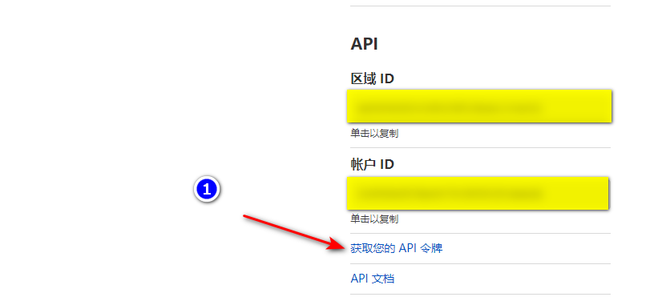
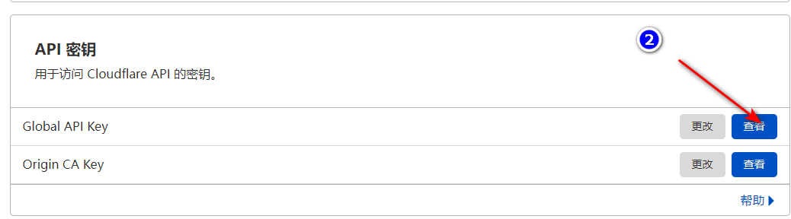
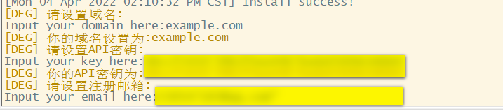

# x-ui

支持多协议多用户的 xray 面板

# 功能介绍

- 系统状态监控
- 支持多用户多协议，网页可视化操作
- 支持的协议：vmess、vless、trojan、shadowsocks、dokodemo-door、socks、http
- 支持配置更多传输配置
- 流量统计，限制流量，限制到期时间
- 可自定义 xray 配置模板
- 支持 https 访问面板（自备域名 + ssl 证书）
- 支持一键SSL证书申请且自动续签
- 更多高级配置项，详见面板

# 安装&升级

```
bash <(curl -Ls https://raw.githubusercontent.com/vaxilu/x-ui/master/install.sh)
```

## 手动安装&升级

1. 首先从 https://github.com/vaxilu/x-ui/releases 下载最新的压缩包，一般选择 `amd64`架构
2. 然后将这个压缩包上传到服务器的 `/root/`目录下，并使用 `root`用户登录服务器

> 如果你的服务器 cpu 架构不是 `amd64`，自行将命令中的 `amd64`替换为其他架构

```
cd /root/
rm x-ui/ /usr/local/x-ui/ /usr/bin/x-ui -rf
tar zxvf x-ui-linux-amd64.tar.gz
chmod +x x-ui/x-ui x-ui/bin/xray-linux-* x-ui/x-ui.sh
cp x-ui/x-ui.sh /usr/bin/x-ui
cp -f x-ui/x-ui.service /etc/systemd/system/
mv x-ui/ /usr/local/
systemctl daemon-reload
systemctl enable x-ui
systemctl restart x-ui
```

## 使用docker安装

> 此 docker 教程与 docker 镜像由[Chasing66](https://github.com/Chasing66)提供

1. 安装docker

```shell
curl -fsSL https://get.docker.com | sh
```

2. 安装x-ui

```shell
mkdir x-ui && cd x-ui
docker run -itd --network=host \
    -v $PWD/db/:/etc/x-ui/ \
    -v $PWD/cert/:/root/cert/ \
    --name x-ui --restart=unless-stopped \
    enwaiax/x-ui:latest
```

> Build 自己的镜像

```shell
docker build -t x-ui .
```

## SSL证书申请

> 此功能与教程由[FranzKafkaYu](https://github.com/FranzKafkaYu)提供

脚本内置SSL证书申请功能，使用该脚本申请证书，需满足以下条件:

- 知晓Cloudflare 注册邮箱
- 知晓Cloudflare Global API Key
- 域名已通过cloudflare进行解析到当前服务器

获取Cloudflare Global API Key的方法:
    
    

使用时只需输入 `域名`, `邮箱`, `API KEY`即可，示意图如下：
        

注意事项:

- 该脚本使用DNS API进行证书申请
- 默认使用Let'sEncrypt作为CA方
- 证书安装目录为/root/cert目录
- 本脚本申请证书均为泛域名证书

## Tg机器人使用（开发中，暂不可使用）

> 此功能与教程由[FranzKafkaYu](https://github.com/FranzKafkaYu)提供

X-UI支持通过Tg机器人实现每日流量通知，面板登录提醒等功能，使用Tg机器人，需要自行申请
具体申请教程可以参考[博客链接](https://coderfan.net/how-to-use-telegram-bot-to-alarm-you-when-someone-login-into-your-vps.html)
使用说明:在面板后台设置机器人相关参数，具体包括

- Tg机器人Token
- Tg机器人ChatId
- Tg机器人周期运行时间，采用crontab语法  

参考语法：
- 30 * * * * * //每一分的第30s进行通知
- @hourly      //每小时通知
- @daily       //每天通知（凌晨零点整）
- @every 8h    //每8小时通知  

TG通知内容：
- 节点流量使用
- 面板登录提醒
- 节点到期提醒
- 流量预警提醒  

更多功能规划中...
## 建议系统

- CentOS 7+
- Ubuntu 16+
- Debian 8+

# 常见问题

## 从 v2-ui 迁移

首先在安装了 v2-ui 的服务器上安装最新版 x-ui，然后使用以下命令进行迁移，将迁移本机 v2-ui 的 `所有 inbound 账号数据`至 x-ui，`面板设置和用户名密码不会迁移`

> 迁移成功后请 `关闭 v2-ui`并且 `重启 x-ui`，否则 v2-ui 的 inbound 会与 x-ui 的 inbound 会产生 `端口冲突`

```
x-ui v2-ui
```

## issue 关闭

各种小白问题看得血压很高

## Stargazers over time

[](https://starchart.cc/vaxilu/x-ui)
